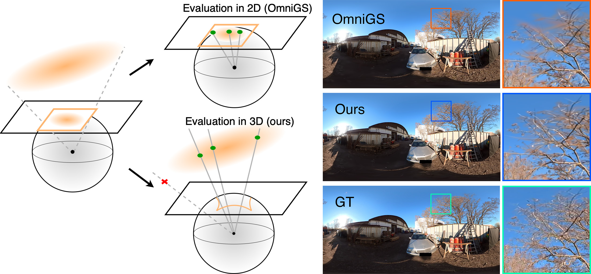

<p align="center">
<h1 align="center"><strong>SPaGS: Fast and Accurate 3D Gaussian Splatting for Spherical Panoramas</strong></h1>
<h3 align="center">EGSR 2025</h3>
<p align="center">
            <span class="author-block">
              <a href="https://www.cg.cs.tu-bs.de/people/li">Junbo Li</a><sup>1</sup>&nbsp;&nbsp;&nbsp;
            </span>
            <span class="author-block">
              <a href="https://fhahlbohm.github.io/">Florian Hahlbohm</a><sup>1</sup>&nbsp;&nbsp;&nbsp;
            </span>
            <span class="author-block">
              <a href="https://www.timonscholz.dev/">Timon Scholz</a><sup>1</sup>&nbsp;&nbsp;&nbsp;
            </span>
            <span class="author-block">
              <a href="https://www.cg.cs.tu-bs.de/people/eisemann">Martin Eisemann</a><sup>1</sup>&nbsp;&nbsp;&nbsp;
            </span>
            <span class="author-block">
              <a href="https://www.cg.cs.tu-bs.de/people/tauscher">Jan-Philipp Tauscher</a><sup>1</sup>&nbsp;&nbsp;&nbsp;
            </span>
            <span class="author-block">
              <a href="https://www.cg.cs.tu-bs.de/people/magnor">Marcus Magnor</a><sup>1,2</sup>
            </span>
    <br>
            <span class="author-block"><sup>1</sup><a href="https://www.cg.cs.tu-bs.de/">Computer Graphics Lab</a>, <a href="https://www.tu-braunschweig.de/">TU Braunschweig</a>, Germany</span>&nbsp;&nbsp;&nbsp;
            <span class="author-block"><sup>2</sup>University of New Mexico, USA</span>&nbsp;&nbsp;&nbsp;
</p>

<div align="center">
    <a href=https://junboli-cn.github.io/spags></a>
    <a href=https://diglib.eg.org/bitstreams/58aad341-5359-4bfb-87cd-b47ae74d3d20/download></a>
    <a href=https://junboli-cn.github.io/spags/supplemental.pdf></a>
</div>

<p align="center">

</p>

## Dataset

We use **OmniBlender** and **Ricoh360** datasets from [EgoNeRF](https://www.changwoon.info/publications/EgoNeRF), and also our own dataset **RaR (Roaming and Rounding)**. Download link: [RaR_pano](https://www.cg.cs.tu-bs.de/upload/projects/drone/datasets/RaR_pano.zip). 

Remarks: The above link only refers to the 360-degree panoramic image data. Our **RaR** dataset also provides perspective image data. The full version can be downloaded from our [project page](https://junboli-cn.github.io/spags). The original image resolution is about 4K, and you can use [mogrify](https://imagemagick.org/script/mogrify.php) to downscale it, for example:

```shell
mogrify -quality 100 -resize 50% -path your_data_path/images_2 your_data_path/images/*.png
```

Also, we used original images from our **RaR** dataset to do the evaluation in our paper. Because we had to keep the published data anonymous (e.g., blurring license plates and faces), the final results might be slightly different from the ones listed in our paper and supplemental material. The new results of **SPaGS** on the published version of the **RaR** dataset are listed below:

|Metric   |   I_alley |   I_avenue |   I_bridge |   I_bypath |   I_garden |   O_car |   O_lion |   O_statuary |   O_stone |   O_windmill |   Mean|
|-------- | --------- | ---------- | ---------- | ---------- | ---------- | ------- | -------- | ------------ | --------- | ------------ | ------|
|PSNR     |    26.096 |     28.650 |     23.514 |     30.675 |     25.396 |  26.385 |   28.459 |       25.130 |    25.112 |       26.567 | 26.598|
|SSIM     |     0.837 |      0.874 |      0.742 |      0.916 |      0.752 |   0.878 |    0.880 |        0.817 |     0.829 |        0.799 |  0.832|
|LPIPS    |     0.254 |      0.219 |      0.327 |      0.227 |      0.293 |   0.180 |    0.185 |        0.264 |     0.212 |        0.273 |  0.243|

## Installation

First follow the instructions to clone and install our [NeRFICG](https://github.com/nerficg-project/nerficg) framework, then go to the directory `your_path/nerficg`.

Then clone this repository into path `src/Methods` of our framework and install it with: 

```shell
./scripts/install.py -m SPaGS
```

## Dataloader

Currently, the dataloaders for the **RaR** and EgoNeRF datasets (**OmniBlender** and **Ricoh360**) have to be moved from `src/Methods/SPaGS/dataloader` to `src/Datasets` directory, you can use the script:

```shell
./src/Methods/SPaGS/move_dataloader.sh
```

## Train

First create a configuration file for training (you can also add the `-a` or `--all` wildcard to create configuration files for the entire dataset at once):

```shell
./scripts/defaultConfig.py -m SPaGS -d <DATASET_TYPE> -o <CONFIG_NAME>
```

Then train a model with created configuration file:

```shell
./scripts/train.py -c configs/<CONFIG_NAME>.yaml
```

or to train the entire dataset at once using:

```shell
./scripts/sequentialTrain.py -d configs/<CONFIGS_FOLDER_NAME>
```

Remarks: 
1. If your GPU have a large VRAM, you can set the `TO_DEVICE` variable to `true` (default is false). This will make training much faster. 
2. Set `IMAGE_SCALE_FACTOR` to `0.5` to use a resolution close to Full HD, the default is the original image resolution (~4K).
3. The near plane is adjusted since some objects in certain scenes of the **OmniBlender** dataset are extremely close to the virtual camera. The values are: `0.05` for the `fisher-hut` scene, `0.01` for the `archiviz-flat`, `barbershop`, `classroom`, `restroom`, `LOU` scenes, and `0.1` for the rest. All the other parameters are all the same as listed in our supplemental material (most of which are already included in the default configuration).

## Visualization

To visualize the trained model, you can use the GUI from our framework:

```shell
./scripts/gui.py
```

then select the folder that contains the model you want to visualize.

## License and Citation

This work is licensed under the MIT license (see [LICENSE](LICENSE)).

If you use this code for your research, please cite:

```bibtex
@article{li2025spags,
  title = {{SP}a{GS}: Fast and Accurate 3D Gaussian Splatting for Spherical Panoramas},
  author = {Li, Junbo and Hahlbohm, Florian and Scholz, Timon and Eisemann, Martin and Tauscher, Jan-Philipp and Magnor, Marcus},
  journal = {Computer Graphics Forum},
  doi = {10.1111/cgf.70171},
  volume = {44},
  number = {4},
  month = {Jun},
  year = {2025}
}
```